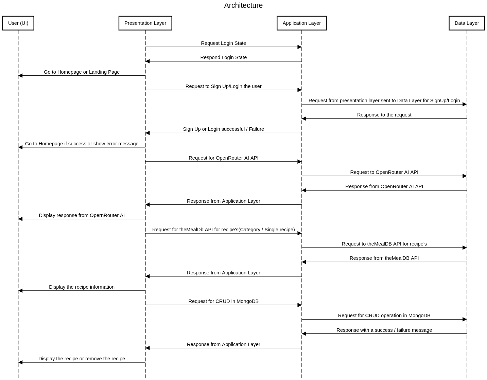

# RecipeMaster FRONTEND

- frontend link: https://capstone-project-frontend.ue.r.appspot.com/
- backend link: https://exalted-legacy-481104-h4.ue.r.appspot.com/
- video link: 

## DEV CONTAINER INFORMATION
- The Dev container used in this project is the Docker container.
- There are 2 Dev containers used in this capstone project, one for the frontend and one for the backend.
- The frontend container contains the frontend folder which contains the react code.
- The backend container contains the backend folder which contains the express code.
- Both the containers are pushed into GitHub for version control.

## CONFIGURATION AND SETUP

- Clone the repository which contains .devcontainer
- Open the folder in the vscode as a docker container
- Change directory to frontend with the command "cd frontend"
- Now run "npm install" to install all the necessary files
- create a .env file inside frontend folder and add ```REACT_APP_CLIENT_ID=<google client id>```


## ARCHITECTURE EXPLANATION

### The project follows a 3-Tier Architecture, which separates the system into three distinct layers: Presentation Layer, Application (Business Logic) Layer, and Data Layer.

### Presentation Layer:

- This layer handles the user interface (UI), built using React.
- It is responsible for displaying the data to the user and collecting user inputs.
- All user requests, like adding, updating, or viewing recipes, originate from this layer.

### Application Layer:

- Implemented using Express.js, this layer processes requests from the Presentation Layer.
- It contains the core logic of the application, like validating inputs, handling CRUD operations, and communicating with external APIs.
- Acts as a bridge between the UI and the data storage.

### Data Layer:

- Consists of MongoDB and Google Cloud services for storing and retrieving data.
- Handles all data storage, retrieval, and updates requested by the Application Layer.
- Ensures data consistency, persistence, and efficient access.

### Flow of Requests:
- User interacts with the Presentation Layer → sends request to Application Layer → Application Layer queries the Data Layer → Data Layer returns response → Application  Layer processes and sends it back to Presentation Layer.
- This architecture ensures modularity, scalability, and maintainability, as each layer is loosely coupled and can be developed or updated independently.


## DEPLOYMENT STEPS

- The website is deployed to Google Cloud.
- Inside the .devcontainer folder and inside the devcontainer.json file add ```"ghcr.io/dhoeric/features/google-cloud-cli:1": {"version": "latest"}``` inside the features.
- Rebuild the container
- In the terminal, verify the google cloud installation by ```gcloud --version```
- Authenticate the google cloud with ```gcloud auth login``` command
- After authentication, setup the project with ```gcloud config set project <project-id>```
- Create the build file in react with the command ```npm run build```
- Create *app.yaml* file and paste the below commands into the file for the website to host.
```
runtime: nodejs20

env_variables:
  REACT_APP_CLIENT_ID: <google client-id>

handlers:
  # Serve static assets (JS, CSS, images, etc.)
  - url: /(.*\.(js|css|png|jpg|jpeg|gif|svg|ico|json|map))
    static_files: build/\1
    upload: build/(.*\.(js|css|png|jpg|jpeg|gif|svg|ico|json|map))

  # React Router fallback
  - url: /.*
    static_files: build/index.html
    upload: build/index.html
```
- Make sure the *Google Client ID* is added which can be got from *Google OAuth* in Cloud Console.
- Now execute ```gcloud app deploy``` to host the website
- After deploy execute ```gcloud app browse``` to see the URL

## INSTRUCTIONS TO RUN THE PROJECT LOCALLY
- Make sure you have completed the setup
- After setting up the project open the terminal in the frontend foler inside the dev container
- Now run ```npm run start``` to run the webpage in development mode or ```npm run start:test``` to run the webpage in testing mode
- Make sure the server url is correctly configured in the server_config.js file.

## TEST FILE AND INSTRUCTIONS
- Testing of the webpage is done by playwright
- Install the playwright test using ```npm i playwright```
- This creates the test folder inside the frontend folder with the file name ```example.spec.js```
- This directory already contains the playwright test file for testing. Playwright will be installed when ```npm install``` is executed inside frontend folder.
- There are 4 tests inside ```example.spec.js``` folder.
- First test is to check for the heading *RecipeMaster*, Second test is to test the *Start Exploring Recipes* button and Third test is to test the *Add your own Recipe* button and Fourth test is to test the *form by adding the recipe* and clicking the *Add Recipe Button*.
- Make sure to run the webpage in testing mode and disable the animationa while testing. 

## DESIGN ARTIFACT: SEQUENCE DIAGRAM



## ATTRIBUTION
 - https://www.npmjs.com/package/aos
 - https://github.com/tarampampam/error-pages
 - https://react-bootstrap.netlify.app/
 - https://www.npmjs.com/package/react-router-dom
 - https://www.npmjs.com/package/swr
 - https://developers.google.com/identity/protocols/oauth2